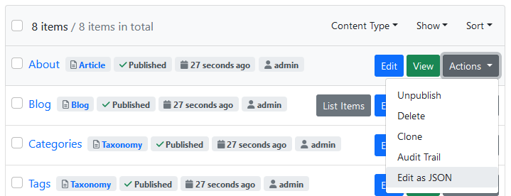
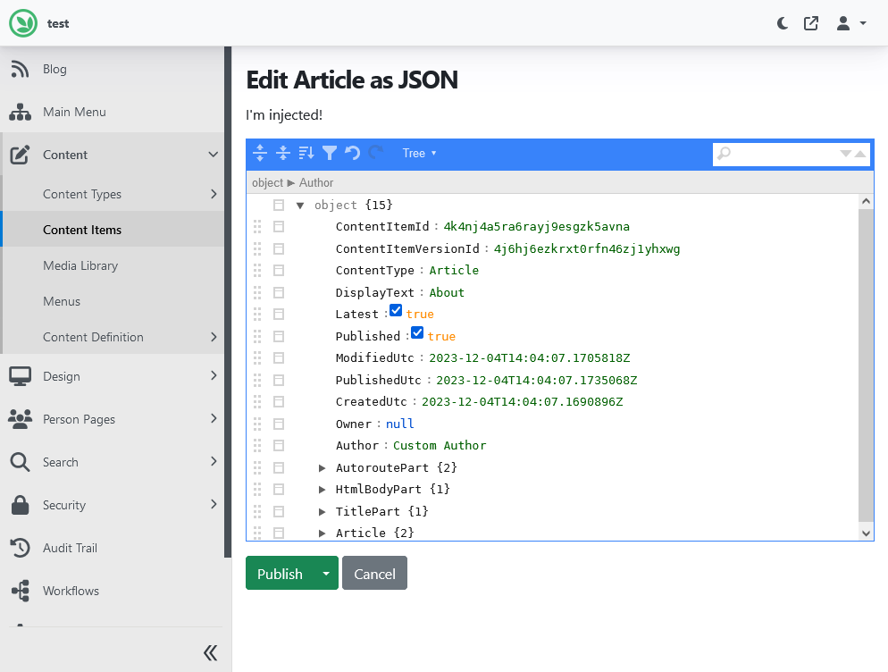

# Lombiq JSON Editor for Orchard Core

[](https://www.nuget.org/packages/Lombiq.JsonEditor/) [](https://www.nuget.org/packages/Lombiq.JsonEditor.Tests.UI/)

## About

Orchard Core module for displaying a JSON Editor like on [jsoneditoronline.org](https://jsoneditoronline.org/). Watch a demo video of it from the Orchard Community Meeting [here](https://www.youtube.com/watch?app=desktop&v=nFhRjhXTKAY).

Do you want to quickly try out this project and see it in action? Check it out in our [Open-Source Orchard Core Extensions](https://github.com/Lombiq/Open-Source-Orchard-Core-Extensions) full Orchard Core solution and also see our other useful Orchard Core-related open-source projects!

## Documentation

### JSON Editor

You can use the JSON editor either as a content field by adding a _Json Field_ to your content type, or by invoking the "JsonEditor" shape with the below tag helper:

```html
<json-editor 
    content="@viewModel.SomeObjectOrJToken"
    options="@viewModel.JsonEditorOptions"
    name="@Html.NameFor(model => model.SomeObjectOrJToken)"></json-editor>
```

or

```html
<json-editor 
    json="@viewModel.SerializedJsonString"
    options="@viewModel.JsonEditorOptions"
    name="@Html.NameFor(model => model.SerializedJsonString)"></json-editor>
```

The properties are:

- Content ("content"): An `object` or `JToken` that will be serialized via [Newtonsoft Json.Net](https://www.newtonsoft.com/json).
- SerializedJson ("json"): An already serialized `string` that can be used as an _alternative_ to Content. Both shouldn't be used, but in case they are, Content takes precedence.
- Options ("options"): A `JsonEditorOptions` object that contains configuration for the JSON editor. See the XML documentation of the `JsonEditorOptions` for more information.
- InputName ("name"): The HTML name of the associated hidden `<input>` element.

All attributes are optional. If neither content nor json is set, an empty object is taken as the content.

### JSON Content Editor

The module also provides an editor for content items. This can be used to directly edit a content item as JSON data. This tool can be useful to inspect how the content item is serialized in the YesSql database without directly accessing the database or exporting the content item via deployment. It can also be used to edit properties that currently don't have an editor.

When the module is enabled, a new _Edit as JSON_ entry is added to the actions dropdown in the admin dashboard's content item listing:



Clicking on it encodes the content item as JSON and displays it in the JSON editor:



This still requires edit permission to the content item, so the security is the same as the regular content item editor. Clicking _Publish_ deserializes the received JSON into a ContentItem and publishes it.

## Dependencies

This module has the following dependencies:

- [Lombiq Helpful Libraries for Orchard Core](https://github.com/Lombiq/Helpful-Libraries)
- [Lombiq Node.js Extensions](https://gihub.com/Lombiq/NodeJs-Extensions)

## Contributing and support

Bug reports, feature requests, comments, questions, code contributions and love letters are warmly welcome. You can send them to us via GitHub issues and pull requests. Please adhere to our [open-source guidelines](https://lombiq.com/open-source-guidelines) while doing so.

This project is developed by [Lombiq Technologies](https://lombiq.com/). Commercial-grade support is available through Lombiq.
